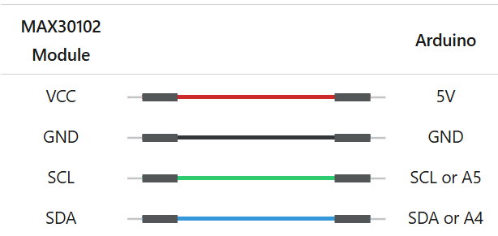
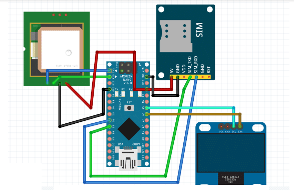
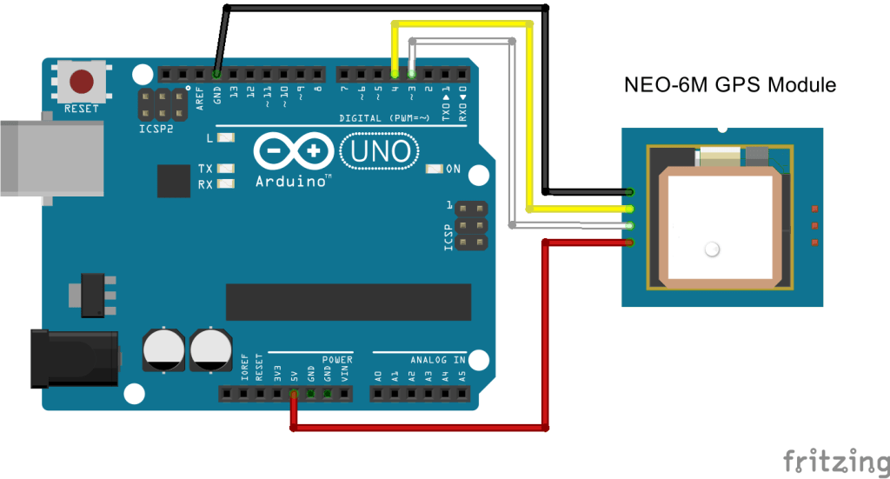

## What it is about
Potential Functions include:
1. Collect and record heart and sweat data, and alarm for abnormalities.

2. Medicine box, first aid

3. Detect the presence of dangerous objects around the walker, such as water, ice, slippery surfaces, sharp objects (such as glass fragments), rugged roads, muddy surfaces, sudden rise or fall of the ground, detect foreign objects, such as various animal excrement, paint and other factors that affect walking, and give voice alarms.

4. In case of emergencies, release the gripper to assist the walker to maintain body balance--prevent falling

5. Emergency phone

6. GPS - can find location

1、采集、记录心脏、汗量数据，异常报警。

2、 药盒，急救

3、探测步行者周围危险物的存在，如水面、冰层、易滑表面、尖锐物体（如玻璃碎屑），崎岖路段，泥泞地表，地面突然升高、或下降，探测异物，如各种动物排泄物，油漆等影响步行因素是否存在，并语音报警。

4、突发情况下，释放抓地手，辅助步行者保持身体平衡--防摔倒

5、 急救电话

6、Gps，可查找定位

### Collect and record heart and sweat data 
Pulse Sensor + Arduino

Heatbeat reference: https://lastminuteengineers.com/max30102-pulse-oximeter-heart-rate-sensor-arduino-tutorial/ 

Schematics

### Object Detection + Voice allert

ESP32-CAM + Edge impulse

### Emergency Call + GPS find location
#### Option 1: 
NEO-6M GPS Module + Arduino Nano + SIM800L -> 2G sim card
Phone call reference: https://medium.com/@robotamateur123/how-to-send-a-message-and-make-a-phone-call-from-arduino-with-sim800l-f65db28a5c60 

Hardware setup: 
1. Connect the SIM800L's VCC to a stable 3.7V-4.4V power source, such as a Li-ion battery or a buck converter capable of providing at least 2A, as the module can draw significant current during calls. Do not power it directly from the Arduino Nano's 5V pin.
2. Connect the SIM800L's GND to the Arduino Nano's GND.
3. Connect the SIM800L's TxD to an Arduino Nano digital pin configured as Rx for SoftwareSerial (e.g., pin 2).
4. Connect the SIM800L's RxD to an Arduino Nano digital pin configured as Tx for SoftwareSerial (e.g., pin 3). 

GPS Reference: https://www.electronicsforu.com/electronics-projects/smart-gps-tracker-using-arduino#components

Software Libraries: 
- ‘Tiny GPS++’ and ‘FONA’ in the Arduino IDE 

Schematics: 

#### (Backup) Option 2:
NEO-6M GPS Module + Arduino UNO

Reference article: https://projecthub.arduino.cc/the_electro_artist/arduino-location-tracker-ed1f85 

NEO-6M:
- Power supply: 3V to 5V 

Wiring:
NEO-6M GPS ModuleWiring to Arduino UNOVCC5VRXTX pin defined in the software serialTXRX pin defined in the software serialGNDGND. 

Schematics:

#### (Backup) Option 3:
Make a voice call using GSM shield + microphone + speaker

Reference: https://docs.arduino.cc/retired/library-examples/gsm-library/GSMExamplesMakeVoiceCall/ 

## Parts List
Heart Rate Sensor Module MAX30102:($26)
https://www.amazon.ca/MAX30102-Detection-Concentration-Compatible-Arduino/dp/B07ZQNC8XP/ref=sr_1_12?dib=eyJ2IjoiMSJ9.-u48crdJYGELCpanbNpdwucIRGLUbOk6KJKzq0XdhhHD_2yODjMW6YqbJNP5xaF6LFm4hS4GWo7VZhL59CwevNNrLkAmVPo6HeD5WOi9_TJRmqJIoMw2-hwzy8CqklFVBRO5f8cnwfrwjL_-s1QoP5gs1ckUJoU6reM3VZM2HGjcuvPwNes3OyeQTlukZhhpn4aKxb9INmvz6Hy9lr8Sm9Qo5VugrQQen0epzA85RRI5QCHbMV6ulFqBkjGPuU2fEle1PBlO21fpJ4OHH4IoYLeDh-TlpUKXblJ6aDptCPY.7UfrE-FiziKfnr3R2iS_xz9j-rWrENawXnH00g7_TjY&dib_tag=se&keywords=Heart+pulse+sensor&qid=1753655423&sr=8-12 

Camera ESP32 CAM: ($27.5)
https://www.amazon.ca/ESP32-CAM-MB-Aideepen-ESP32-CAM-Bluetooth-Arduino/dp/B0948ZFTQZ/ref=sr_1_5?crid=19YST57O06H2H&dib=eyJ2IjoiMSJ9.bZlAqSuLNkiY5V5kP-GLSKhAH_thcUnqCHLidhiQXbsTFYPr8tsALR5gUxNmN4vWtv-occuT8k3jZ6hvQlxKaraVWkPavCFQntde5c8wgh8d-cZ6cBoO_VBlgaMq7dGUm2GeGfuDz6tyQN1d54lrpHC3yLPVixPiTIE6bc3aiTqBDmU_TZueoHI-qeJNsMggfV1OgQ4pGqunPhSibPazPQMKczsf3HYEGJFV2Zk9cJ3ROFBRNUR1eMsBKMmT0bMYeCIUuYWzICKnlRSy5JW44iwq8Uyiiwq59g5Usv3fKuk.L2e-cEh7agJfp4ONclyBVir5GOqd6fQEd44Nn5_-ODI&dib_tag=se&keywords=ESP32+cam&qid=1753665896&sprefix=esp32+cam%2Caps%2C109&sr=8-5

GPS:
NEO-6M: ($18)
https://www.amazon.ca/HiLetgo-GY-NEO6MV2-Controller-Ceramic-Antenna/dp/B01D1D0F5M/ref=sr_1_11?crid=24WWMXYF6MSVG&dib=eyJ2IjoiMSJ9.ofjC6c_-RNyT6Ardh-dm8ZG7-FExdukiW0_KE529SahbY_l7v9ZDjhq4EogH44wFm36anrBkWT1tluZtxCcxnzk6oujFY65wdNSUUjAMIXTKPR0rQ08Cg8W4LDvbJLzkO4nnq5kTlWuQDnUepS14uK1mHav3i3q770r6RaWuPYhKt-crVdYsmy6Q0wUSZzjPuIL2ppcoXaCARRIPPHNr0mPsKfBy62G6vqg5DQ68A6QLwa7JQJ6pyFB7sUDXNewp5M5CPicdWQtXIveGdm4htbDYO3pdP_9dQROwoT1f6OA.bGvYZmE57t8F9X7t2V-eJGAZwdkoHfSKF0UQqfCpYuw&dib_tag=se&keywords=NEO-6M&qid=1753655857&sprefix=neo-6m%2Caps%2C180&sr=8-11

Call: 
SIM card module SIM800L: ($16 + $5 delivery)
https://www.amazon.ca/HiLetgo-Smallest-Breakout-Quad-Band-3-7-4-2V/dp/B01DLIJM2E/ref=sr_1_5?crid=20NL0AHPDI79T&dib=eyJ2IjoiMSJ9.FHe8Hk0kVaat3qAvNRr0p6I3_tIaIOkwbZuabiDLXS0D6a27lsFwmW56Z9PFEboPVe8Nl1tt6AbXxC9I74SrB4QpgSw8ee_c88BMPemKCFbOKszEhuetrsKPrLHR6eqp5N3bGsMjy7L6OuxELm1Coop2UCVKS46RHab_R9MNckPsdd3VqWaHptQLnx7QTF7oOTf94aoWbwyQFQbeZAp4XDmcxKVhDACIiBMvw2XSFg2XIO0ppI4PXEyrfbbxBfAgDeZcYzYWc1h8acuxZr2Sy3ml-uWki_sOK-ZzKvPfhiQ.bmdSWzG5iWpbxG32Q7Aq7gfkFxlssMUNFcfoPR9yYkc&dib_tag=se&keywords=SIM800L&qid=1753655942&sprefix=sim800l%2Caps%2C149&sr=8-5 
